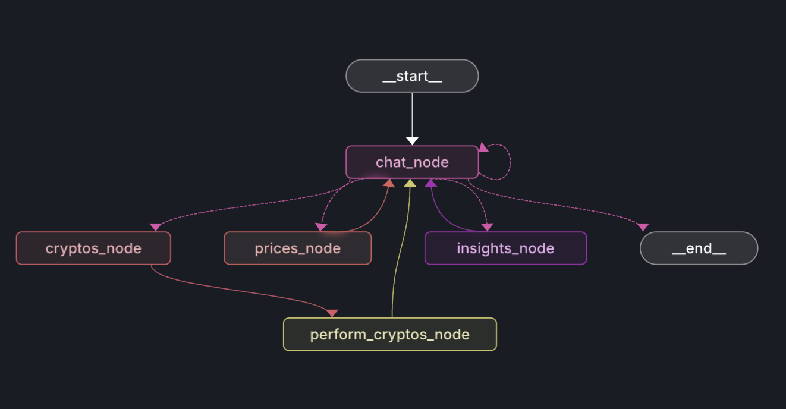

# Crypto Talks


The site is live! Check it out at [https://crypto-talks-eta.vercel.app/](https://crypto-talks-eta.vercel.app/)

## Project Overview

Crypto Talks is a comprehensive cryptocurrency platform designed to provide users with real-time insights, interactive tools, and intelligent analytics for the crypto ecosystem.

## Features

### Cryptocurrency Market Overview
- Real-time cryptocurrency prices
- Detailed price charts
- Market cap and technical coin details

### Intelligent AI Assistance
- Crypto-focused chatbot
- Coin-specific AI interactions
- Automated news summarization

### Portfolio Management
- Track cryptocurrency holdings
- Real-time portfolio valuation
- Performance analytics

## Tech Stack

- [](https://nextjs.org/)
- [](https://github.com/features/copilot)
- [](https://tailwindcss.com/)
- [](https://ui.shadcn.com/)
- [](https://appwrite.io/)
- [](https://groq.netlify.app/)
- [](https://langgraph.dev/)

## Langraph Integration



The graph consists of 4 nodes:

1. **Chat Node**: This node is responsible for the chatbot. It uses the Groq API to generate responses.
2. **Prices Node**: This node is responsible for fetching the prices of the cryptocurrencies. It uses the CoinGecko API to fetch the prices.
3. **Insights Node**: This node is responsible for fetching the insights of the cryptocurrencies.
4. **Cryptos Node**: This special node holds the state of cryptocurrency for the user, being able to add, delete and update the cryptocurrencies in the user's portfolio.

## Getting Started

### Prerequisites
- Node.js (v18 or later)
- npm or yarn or pnpm
- Appwrite account
- Groq API Key
- Langsmith API Key (For testing only)

### Installation

1. Clone the repository
```bash
git clone https://github.com/your-username/crypto-talks.git
cd crypto-talks/ui
```

2. Install dependencies
```bash
npm install
```

3. Set up environment variables
Create a `.env.local` file with the following:
```
NEXT_PUBLIC_APPWRITE_ENDPOINT=your_appwrite_endpoint
NEXT_PUBLIC_APPWRITE_PROJECT=your_project_id
GROQ_API_KEY=your_groq_api_key
```

4. Run the development server
```bash
npm run dev
```

## License

Distributed under the MIT License. See `LICENSE` for more information.

---

**Disclaimer**: Cryptocurrency investments carry risk. Always do your own research and consult financial advisors.